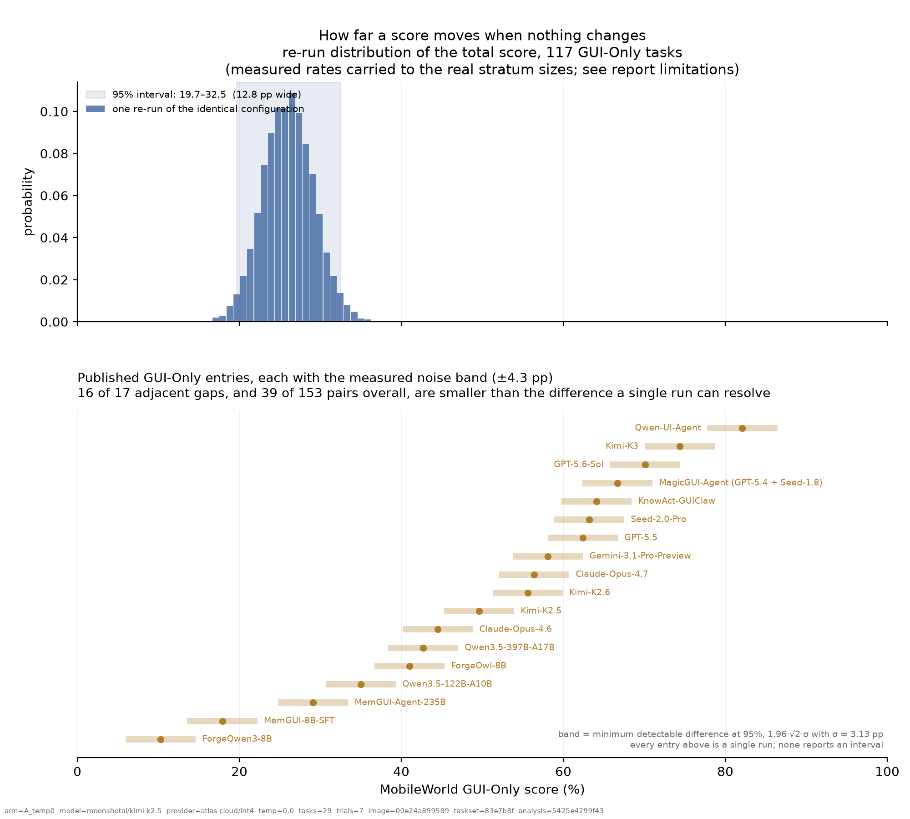
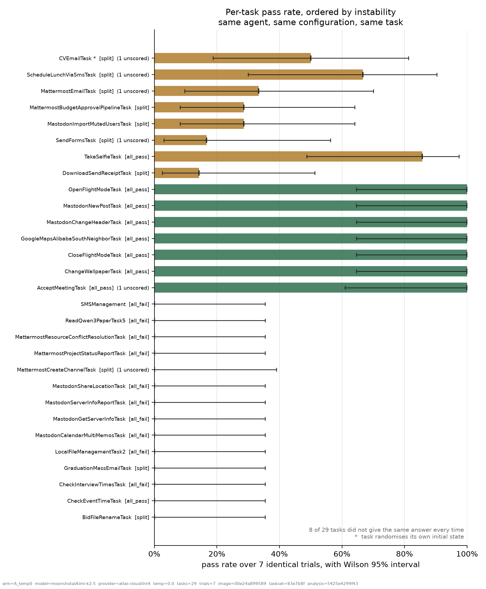
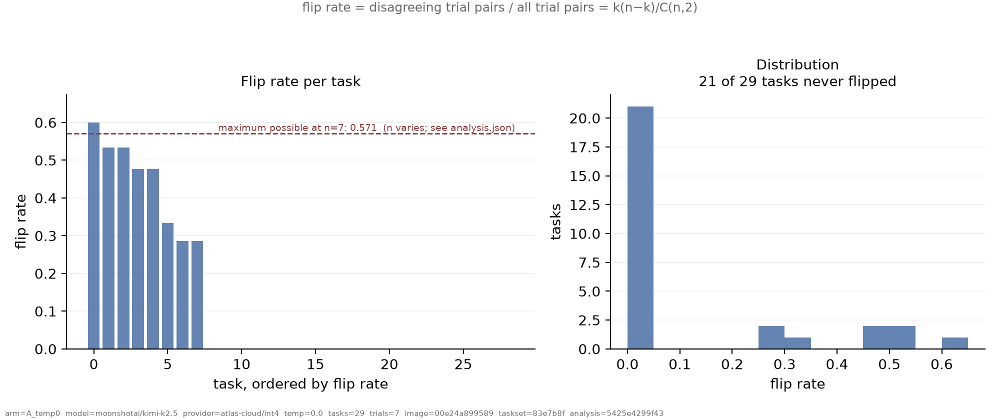

<!--
  Source template. Do not edit report/REPORT.md -- it is generated:

      python3 scripts/analyze.py
      python3 scripts/plots.py
      python3 scripts/render_report.py

Every number below is a placeholder resolved out of data/analysis.json. Typing
one in by hand defeats the only check this project has. -->

# How much does a MobileWorld score move when nothing changes?

A measured noise floor for the
[MobileWorld](https://github.com/Tongyi-MAI/MobileWorld) mobile-agent
benchmark: the same agent, the same configuration, the same tasks, run 7 times.

This is not a criticism of MobileWorld. Every benchmark that drives a real
operating system through a real UI against real network services has run-to-run
variance; that is the price of not being a static test set, and it is a price
worth paying. What has been missing is a number for it. Without one, a reader
cannot tell whether a two-point gap on the leaderboard means anything. This
report supplies the number, the data behind it, and the code to reproduce it.

---

## TL;DR

Three findings. The first is the one this project set out to measure. The
second and third were not planned, apply to any leaderboard built on hosted
inference, and are the reason this report is worth reading if you do not care
about MobileWorld at all.

### 1. A benchmark score moves when nothing changes, and the moves are as large as the gaps being cited

The same suite, re-run under an identical configuration, moved **8.1 points**
between its best and worst repetition — 31.0% to 39.1%, across 7 repetitions
with the model, serving provider, quantization, image digest, task-set commit,
temperature and seed all pinned. 8 of 29 tasks did not return the same verdict
every time.

Two entries need to differ by **8.6 points** before one run each can tell them
apart. **16 of the 17 adjacent gaps** on the published GUI-Only board are
smaller than that, as are 39 of its 153 pairs overall. 37 of the 40 entries are
single runs and none reports an interval.

### 2. The serving endpoint changed mid-experiment. Nothing pins it, nothing records it, and nobody would see it

Partway through a thirty-hour run, with every knob still pinned, the provider
changed its serving configuration. **10 tasks got worse and 0 got better** (p =
0.002). The model's reasoning per action dropped **20.1%** in one step and held
at the new level. An identical probe sent outside the harness a day apart
reproduces it; a second provider used as a control does not move.

> Two vendors running this benchmark a day apart — same model id, same
> quantization, same provider — are compared against each other across a gap
> neither of them can see.

There is no flag that pins a serving configuration, and no leaderboard entry
records which one produced it. This is not a MobileWorld problem. It applies to
every leaderboard built on hosted inference.


### 3. `temperature=0` is not determinism — and the obvious way to check gives the wrong answer

Three identical requests, same prompt, same fixed seed, temperature 0, returned
three different completions on **both** serving endpoints tested. Both
advertise `seed` support.

The methodological trap matters more than the result. An earlier check of the
same endpoint used a trivial prompt — "reply with OK" — and returned
byte-identical output twice, which reads as proof of determinism. A
thirty-token answer is identical under any sampler. **Determinism has to be
probed at the output length the real workload produces**, or the check silently
confirms whatever you hoped.



---

## What was measured, and what was not

**Measured.** The distribution of the benchmark's own output when its input is
held fixed. One trial = one task, executed once, in a container created fresh
for that repetition round.

**Not measured.** Whether any model is better than any other. This report says
nothing about capability. It says how finely the instrument can distinguish
capabilities at all.

Two variance sources were separated:

| source | held down by |
|---|---|
| model sampling | `temperature=0`, fixed `seed`, provider and quantization pinned |
| environment: container state, timing, backend services, network | one fresh container per repetition round, strictly serial execution, pinned image digest, pinned task-set commit |

Arm `A_temp0` is the headline. It was designed on the assumption that what
survives `temperature=0` is mostly environment. **That assumption was tested
and does not hold.** Three identical requests to the pinned endpoint — same
prompt, same seed, temperature 0 — produced three different completions,
varying about twofold in length, on both serving providers examined. Both
advertise `seed` support in OpenRouter's capability list.

So this report does not claim to separate environment from model. Arm A
measures **the total run-to-run variance that survives every control available
to a careful experimenter**: pinned image digest, pinned task-set commit, fresh
container per round, serial execution, pinned provider and quantization,
temperature 0, fixed seed. That is the number a reader comparing two
leaderboard entries needs, because it is the noise they are up against
regardless of its origin.

### The task set

29 GUI-Only tasks, chosen from public data before any compute was spent, in
three groups:

| bucket (chosen from published runs) | tasks | mean pass rate | flipped | mean flip rate |
|---|---|---|---|---|
| all_fail | 10 | 0.0% | 0 | 0.000 |
| all_pass | 9 | 87.3% | 1 | 0.032 |
| split | 10 | 23.8% | 7 | 0.324 |

The groups come from the 18 trajectory bundles MobileWorld publishes: tasks
that every published run passed, tasks that every published run failed, and
tasks they disagreed on. Cross-model disagreement is **not** the same thing as
run-to-run variance — it is a prior about where to look. The two control groups
exist so that instability found in the third group can be compared against
something.

GUI-Only was chosen because it needs neither a second LLM playing the user nor
MCP credentials, so the configuration has fewer moving parts and is cheaper for
someone else to reproduce.

---

## Method

|  |  |
|---|---|
| model | moonshotai/kimi-k2.5 |
| serving | atlas-cloud / int4 |
| sampling | temperature=0.0 seed=42 |
| agent | agents/pinned_e2e_agent.py |
| image | `ghcr.io/tongyi-mai/mobile_world:v1.4` |
| image digest | `sha256:00e24a8995892af9a0e1b68bc14ce455fae288d0f1ca8cf57e84a58e40e9f19e` |
| task-set commit | `83e7b8fc75ebb6c4a098254a42999db5f4172666` |
| max rounds / step wait | 50 / 3.0s |
| harness auto-retry | 10 |
| container recycling | trial |
| host kernel | 6.17.0-1022-gcp |
| runs.jsonl sha256 | `5425e4299f4317033ac15c216228c81a796c9d2e3097f16b900b3138847b9668` |

- **Serial.** `--max-concurrency 1`, no task shuffling. Concurrency and
  ordering are themselves timing variables.
- **Fresh container per repetition round.** Task objects are singletons reused
  across episodes (`tasks/registry.py:82`) and upstream has already had to fix
  cross-episode state leakage once (commit `5adc031`), so state is destroyed
  between rounds rather than trusted.
- **Provider pinned.** On OpenRouter a single model id fans out to many
  providers at different quantizations, which are not the same weights. Left
  unpinned, that routing variance would land in these results labelled as
  environment noise. `agents/pinned_e2e_agent.py` sends `{"provider": {"only":
  [...], "quantizations": [...], "allow_fallbacks": false}}`, so a request
  either runs on the pinned endpoint or fails loudly — and it merges that into
  whatever the harness put there, because the harness overwrites the field for
  this model family (above). Every request's actual serving provider is read
  back off the response and written into the trial's own log, so the pinning is
  evidenced rather than assumed.
- **Pass threshold `score > 0.99`**, which is upstream's own
  (`core/log_viewer/utils.py:489`). Note that `runner.py` logs success as
  `score > 0.0`; the two disagree, and the stricter one is used here.
- **Nothing under `vendor/` was modified.** The custom agent is supplied
  through the harness's own `--agent-type <path.py>` hook, so reproducing this
  does not require forking the benchmark.

Runs that produced no score are reported separately rather than counted as
failures:

| outcome | runs | share |
|---|---|---|
| scored | 197 | 97.04% |
| no_result | 6 | 2.96% |

---

## Results

### The direct observation

Each repetition is a complete pass over the task set, so each one has a suite
score. These are raw counts — no model, no resampling:

| trial | tasks scored | passed | suite score (%) |
|---|---|---|---|
| 4 | 29 | 9 | 31.0 |
| 5 | 29 | 9 | 31.0 |
| 6 | 23 | 9 | 39.1 |
| 7 | 29 | 10 | 34.5 |
| 8 | 29 | 11 | 37.9 |
| 9 | 29 | 11 | 37.9 |
| 10 | 29 | 10 | 34.5 |

Best minus worst: **8.1 points**. The mean absolute difference between any two
repetitions is 4.0 points.

### Per task



Tasks that did not give the same answer every time, most unstable first:

| task | bucket | passed | pass rate | Wilson 95% | flip rate |
|---|---|---|---|---|---|
| CVEmailTask | split | 3/6 | 50% | 19–81% | 0.600 |
| MattermostEmailTask | split | 2/6 | 33% | 10–70% | 0.533 |
| ScheduleLunchViaSmsTask | split | 4/6 | 67% | 30–90% | 0.533 |
| MastodonImportMutedUsersTask | split | 2/7 | 29% | 8–64% | 0.476 |
| MattermostBudgetApprovalPipelineTask | split | 2/7 | 29% | 8–64% | 0.476 |
| SendFormsTask | split | 1/6 | 17% | 3–56% | 0.333 |
| DownloadSendReceiptTask | split | 1/7 | 14% | 3–51% | 0.286 |
| TakeSelfieTask | all_pass | 6/7 | 86% | 49–97% | 0.286 |

`flip rate` is the share of trial *pairs* that disagree — `k(n−k) / C(n,2)` for
`k` passes out of `n` trials. Its maximum is not 1 and depends on `n`: at the
`n = 7` of this arm, an even split scores 0.571. Mean across all tasks: 0.121.



Tasks that were perfectly consistent — useful as a check that the setup is not
simply noisy everywhere:

| task | bucket | passed | outcome |
|---|---|---|---|
| AcceptMeetingTask | all_pass | 6/6 | always passed |
| BidFileRenameTask | split | 0/7 | always failed |
| ChangeWallpaperTask | all_pass | 7/7 | always passed |
| CheckEventTimeTask | all_pass | 0/7 | always failed |
| CheckInterviewTimesTask | all_fail | 0/7 | always failed |
| CloseFlightModeTask | all_pass | 7/7 | always passed |
| GoogleMapsAlibabaSouthNeighborTask | all_pass | 7/7 | always passed |
| GraduationMassEmailTask | split | 0/7 | always failed |
| LocalFileManagementTask2 | all_fail | 0/7 | always failed |
| MastodonCalendarMultiMemosTask | all_fail | 0/7 | always failed |
| MastodonChangeHeaderTask | all_pass | 7/7 | always passed |
| MastodonGetServerInfoTask | all_fail | 0/7 | always failed |
| MastodonNewPostTask | all_pass | 7/7 | always passed |
| MastodonServerInfoReportTask | all_fail | 0/7 | always failed |
| MastodonShareLocationTask | all_fail | 0/7 | always failed |
| MattermostCreateChannelTask | split | 0/6 | always failed |
| MattermostProjectStatusReportTask | all_fail | 0/7 | always failed |
| MattermostResourceConflictResolutionTask | all_fail | 0/7 | always failed |
| OpenFlightModeTask | all_pass | 7/7 | always passed |
| ReadQwen3PaperTask5 | all_fail | 0/7 | always failed |
| SMSManagement | all_fail | 0/7 | always failed |

### Tasks that randomise their own initial state

Seven tasks in the benchmark call `random.choice` / `randint` / `sample` in
their own setup, and nothing anywhere in the codebase calls `random.seed()`.
The README's claim that each execution "begins from identical initial
conditions" does not hold for them: they are a different problem each run. This
pilot contains 1 of them, never pooled with the rest, because it measures
something else.

| task | passed | flip rate |
|---|---|---|
| CVEmailTask | 3/6 | 0.600 |

### The total score

Three numbers that are easy to confuse, so all three are reported:

| question | 95% interval | σ |
|---|---|---|
| If this same 29-task set were run again, where would the total land? **Headline.** | 27.6–48.3% | 5.87 pp |
| Same, pretending 7 trials pinned each rate down exactly — a lower bound | 27.6–44.8% | 4.19 pp |
| How precise is *this experiment's own* number? | 32.1–38.6% | 1.65 pp |

A total over 29 tasks moves in discrete steps — each task either passes or it
does not — so the first two rows can quote the same interval while differing in
σ: their percentiles land on the same step. At this size σ is the comparison
that carries information.

Carried up to the real GUI-Only suite — the pilot's three groups reweighted to
their true sizes (98 split, 9 always-passed, 10 always-failed, out of 117).

**This is the report's largest inferential step and it is conditional**: *if*
the 88 split-group tasks that were not run behave like the 10 that were, then —

| | 95% interval | width | σ |
|---|---|---|---|
| fixed task set, noise only | 19.7–32.5% | **12.8 pp** | 3.13 pp |
| also resampling which tasks are in the suite | 19.7–34.2% | 14.5 pp | 3.65 pp |

The first row is the one to compare with a leaderboard gap: it asks how much a
score moves with the task set held fixed, which is what happens when two
vendors run the same benchmark. The second row also asks whether the other 88
disagreed-on tasks behave like the 10 measured here, which is a question about
generalisation, not about noise.

All resampling is seeded (`20260824`, 10000 resamples), so the same
`runs.jsonl` always produces the same `analysis.json`.


### Does any single round drive this?

The obvious challenge to a spread measured over a handful of repetitions is
that one unusual round produced it — and one round here *was* unusual: a
provider outage cost it six scores and most of the run's silent retries.
Singling that round out for a robustness check would invite the suspicion that
it was chosen after seeing the answer, so every round is dropped in turn and
everything recomputed from scratch on what is left:

| round dropped | rounds left | observed range (pp) | detectable difference (pp) | tasks that flipped | adjacent gaps needing a second run |
|---|---|---|---|---|---|
| 4 | 6 | 8.1 | 8.96 | 8 | 16 of 17 |
| 5 | 6 | 8.1 | 8.47 | 8 | 16 of 17 |
| 6 | 6 | 6.9 | 8.07 | 7 | 16 of 17 |
| 7 | 6 | 8.1 | 8.38 | 7 | 16 of 17 |
| 8 | 6 | 8.1 | 7.91 | 7 | 16 of 17 |
| 9 | 6 | 8.1 | 8.69 | 8 | 16 of 17 |
| 10 | 6 | 8.1 | 8.96 | 8 | 16 of 17 |

The detectable difference stays between **7.91 and 8.96 points** whichever
round is removed, against 8.64 for the full set — the headline sits inside its
own leave-one-out range rather than at an edge of it. The count of adjacent
leaderboard gaps too small to resolve is 16–16 of 17 across every variant.

Dropping the outage round specifically does not weaken the result; it makes the
interval slightly *narrower*, and at least one other round narrows it more.

---


### The harness absorbed some of this before it could be measured

Inside a task, an exception containing `"Device is not healthy"` makes the
harness sleep, rename the partial trajectory to `*_backup_<ts>`, and rerun in
place, up to twice. Across rounds, `--auto-retry` (default 10) re-runs tasks
that left no `result.txt`. It does **not** re-run tasks that scored 0 — so this
is not best-of-N and the leaderboard is not inflated by it. But it does mean
the variance reported here is what survives two layers of silent retry.

Silent restarts observed in this run: **95**.

They are not spread evenly. Broken down by repetition round:

| repetition round | silent restarts |  |
|---|---|---|
| 4 | 3 |  |
| 5 | 3 |  |
| 6 | 68 | **incident** |
| 7 | 3 |  |
| 8 | 7 |  |
| 9 | 7 |  |
| 10 | 4 |  |

The single worst round accounts for **72%** of them. That concentration is the
signature of an infrastructure incident rather than of task difficulty — a hard
task is hard in every round, an outage happens in one. During this pilot the
serving provider returned HTTP 401 for about an hour; the harness silently
retried through it, some runs survived and some were lost, and **not one of the
scored results carries any trace of it**. Without this column, an hour of total
provider unavailability would be invisible in the data.

Unscored runs, by round:

| repetition round | no_result | scored |
|---|---|---|
| 4 | 0 | 29 |
| 5 | 0 | 29 |
| 6 | 6 | 23 |
| 7 | 0 | 29 |
| 8 | 0 | 29 |
| 9 | 0 | 29 |
| 10 | 0 | 29 |

By task:

| task | silent restarts |
|---|---|
| AcceptMeetingTask | 9 |
| CVEmailTask | 9 |
| ChangeWallpaperTask | 9 |
| MastodonServerInfoReportTask | 9 |
| MattermostCreateChannelTask | 9 |
| MattermostEmailTask | 9 |
| ScheduleLunchViaSmsTask | 9 |
| SendFormsTask | 9 |
| MastodonImportMutedUsersTask | 8 |
| MastodonShareLocationTask | 7 |
| MastodonGetServerInfoTask | 4 |
| MattermostBudgetApprovalPipelineTask | 3 |
| DownloadSendReceiptTask | 1 |

Every one of those is instability that never reached a score. **The measured
noise floor is a floor in both senses.**

---


## The serving endpoint changed underneath the experiment

Everything a careful experimenter can pin was pinned: container image digest,
task-set commit, model id, serving provider, quantization, temperature, seed,
one fresh container per round, strictly serial execution. Partway through, the
results changed character anyway.

|  | before | after |
|---|---|---|
| repetition rounds | 1, 2, 3 | 4, 5, 6, 7, 8, 9, 10 |
| suite score each round (%) | 55.2, 51.7, 48.3 | 31.0, 31.0, 39.1, 34.5, 37.9, 37.9, 34.5 |
| reasoning tokens per action (median) | 132.5 | 105.9  (-20.1%) |

**10 tasks got worse and 0 got better** across the boundary (19 unchanged). A
split that one-sided happens by chance with probability **0.002**. Noise moves
tasks in both directions; this did not.

| task | bucket | before | after | change (pp) |
|---|---|---|---|---|
| SendFormsTask | split | 100% | 17% | -83 |
| BidFileRenameTask | split | 67% | 0% | -67 |
| CheckEventTimeTask | all_pass | 67% | 0% | -67 |
| MattermostCreateChannelTask | split | 67% | 0% | -67 |
| DownloadSendReceiptTask | split | 67% | 14% | -52 |
| CVEmailTask | split | 100% | 50% | -50 |
| MastodonImportMutedUsersTask | split | 67% | 29% | -38 |
| MattermostEmailTask | split | 67% | 33% | -33 |
| TakeSelfieTask | all_pass | 100% | 86% | -14 |
| MattermostBudgetApprovalPipelineTask | split | 33% | 29% | -5 |

The cause is visible in how much the model reasoned per action, which fell by
about a fifth and then held steady at the new level — a step, not a drift. The
endpoint began generating less reasoning per call, so each step got *faster*
while decisions got worse, more steps were needed, more runs hit the round cap,
and the score fell. Degrading hardware or a slow network would have made things
slower, not quicker.

An identical probe sent outside the harness 24 hours apart reproduces it, and a
second provider used as a control does not move. The full evidence is in the
paper (Section 4) and `ENVIRONMENT.md` §8 and §12.

**This is the finding, not a caveat to it.** There is no flag that pins a
serving configuration, and no leaderboard entry records which one produced it.
Two vendors running this benchmark a day apart, with the same model id at the
same quantization from the same provider, can be compared against each other
across a gap neither of them can see.

It also means the pooled spread across all rounds is **not** a pure noise
floor: it mixes run-to-run noise with a one-off configuration change. Where a
single number is quoted below, it comes from within one regime.

---


## What this means for reading the leaderboard

Two single runs must differ by **8.6 points** before the difference is outside
what noise produces on its own; to detect a real difference reliably (80% of
the time) it needs to be 12.3 points.

| entry | next entry below | gap (pp) |  |
|---|---|---|---|
| Qwen-UI-Agent | Kimi-K3 | 7.7 | warrants a second run before citation |
| Kimi-K3 | GPT-5.6-Sol | 4.3 | warrants a second run before citation |
| GPT-5.6-Sol | MagicGUI-Agent (GPT-5.4 + Seed-1.8) | 3.4 | warrants a second run before citation |
| MagicGUI-Agent (GPT-5.4 + Seed-1.8) | KnowAct-GUIClaw | 2.6 | warrants a second run before citation |
| KnowAct-GUIClaw | Seed-2.0-Pro | 0.9 | warrants a second run before citation |
| Seed-2.0-Pro | GPT-5.5 | 0.8 | warrants a second run before citation |
| GPT-5.5 | Gemini-3.1-Pro-Preview | 4.3 | warrants a second run before citation |
| Gemini-3.1-Pro-Preview | Claude-Opus-4.7 | 1.7 | warrants a second run before citation |
| Claude-Opus-4.7 | Kimi-K2.6 | 0.8 | warrants a second run before citation |
| Kimi-K2.6 | Kimi-K2.5 | 6.0 | warrants a second run before citation |
| Kimi-K2.5 | Claude-Opus-4.6 | 5.1 | warrants a second run before citation |
| Claude-Opus-4.6 | Qwen3.5-397B-A17B | 1.8 | warrants a second run before citation |
| Qwen3.5-397B-A17B | ForgeOwl-8B | 1.7 | warrants a second run before citation |
| ForgeOwl-8B | Qwen3.5-122B-A10B | 6.0 | warrants a second run before citation |
| Qwen3.5-122B-A10B | MemGUI-Agent-235B | 5.9 | warrants a second run before citation |
| MemGUI-Agent-235B | MemGUI-8B-SFT | 11.2 | resolvable by single runs |
| MemGUI-8B-SFT | ForgeQwen3-8B | 7.6 | warrants a second run before citation |

This is an indication of scale, not a re-scoring. The noise floor was measured
for one model, on 29 tasks, and is applied above to entries produced by other
agents and other models. It says which gaps *deserve* a second run before being
cited, not which ones are wrong.

Three things follow, none of which requires agreeing with the exact number:

1. **A single run is not a measurement.** Reporting `runs: 1` with no interval
   invites readers to compare numbers that are not comparable. Three runs and a
   range would cost 3× the compute and remove most of the ambiguity.
2. **Rank order near the top is unstable.** Adjacent entries separated by less
   than the noise floor can swap places on a re-run without anything changing.
3. **"State of the art by N points" needs N stated against a noise floor.**

### Things already true without running anything

These come from the public repository alone and are independent of everything
above:

- **37 of the 40 leaderboard entries are single runs** (`runs: 1`); the
  remaining 3 report `runs: 3`. No entry reports variance or an interval.
- **Claude's temperature is deleted before the request is sent.**
  `agents/base.py:96-99`: if `"claude" in model`, `del kwargs["temperature"]`.
  Every Claude entry therefore ran at the API default, not at 0 — so entries on
  the same board carry structurally different sampling noise.
- **`-no-snapshot` is passed to the emulator** (`docker/start_emulator.sh`), so
  the README's "AVD snapshots ensure identical initial state" is not what
  happens; initial state is whatever each task's `initialize_task` establishes.
- **One published run in five ended by running out of steps, not by
  finishing.** Across the 2,562 (model, task) runs in the trajectory bundles
  upstream publishes, **525 — 20.5% — have a step count of exactly 50**,
  against a maximum observed anywhere of 54. That spike is the round cap, and a
  run that hits it is scored 0. Those zeros are not the agent getting the task
  wrong; they are the agent being stopped. `mw eval` itself defaults to no cap
  at all (`core/subcommands/eval.py:373`, `max_step=args.max_round or -1`) —
  the 50 comes from the evaluation server's own defaults
  (`core/eval_server/db.py:40`, `routes.py:642`), so which number applies
  depends on how the run was launched, and nothing in a published entry records
  which. This study passes `--max-round 50` explicitly, to match the published
  runs rather than to be generous.
- **Caller-supplied request options are discarded for some models, by name.**
  `agents/base.py:105-106` replaces `extra_body` wholesale — not merges —
  whenever the model id contains `kimi-k`, so any routing, provider or serving
  option the caller set is dropped at the moment of the call. Two lines above,
  the same function deletes `temperature` for Claude. An experiment that pins
  its serving endpoint therefore has to verify where the request was actually
  served, because the configuration it set is not the configuration that was
  sent. On OpenRouter the difference is not cosmetic: identical unpinned
  requests in this study were served by three different providers, and the same
  trivial prompt drew 87, 476 and 228 reasoning tokens depending on which.
  Combined with `base.py:115`, which calls `.strip()` on a message content that
  reasoning models may return as `None`, a verbose provider and the stock
  `max_tokens` of 2048 can truncate the answer away entirely and fail the task
  through every retry. (Checked against the published bundles: this does *not*
  appear to have affected the leaderboard's own reasoning-model entries, which
  miss a score on well under 1% of tasks.)
- **The harness's own container cleanup silently does nothing unless the image
  tag is `latest`.** `mw env rm --all` selects containers by image substring
  against `DEFAULT_IMAGE = "ghcr.io/tongyi-mai/mobile_world:latest"`
  (`runtime/utils/models.py:28`, `core/api/env.py:507`,
  `runtime/utils/docker.py:102`), and exposes no way to override it. Pin the
  image to any released version and the command prints `No containers to
  destroy` and exits 0 while the containers keep running; the next launch takes
  the next free port, and an evaluation pointed at the original port keeps
  talking to the first container ever created. Every episode then shares one
  container's accumulated state — which is what upstream's own commit
  `5adc031`, "reset per-episode state on reused singleton task instances", was
  written to prevent. Nothing reports it: the stale container is healthy, so
  the health check passes.
- **Entries from different dates were scored by different verifier versions.**
  Upstream's history contains a run of verifier fixes postdating existing
  entries: `8ae5064` (wrong scoring for accept/cancel meeting), `c33e340` (a
  correct MMMU-Pro answer rejected), `32ed916` (phone-format false negatives),
  `702e904` (a task depended on the external site placehold.co), plus the
  README's own note that Mattermost session expiry produced false negatives.

---

## Scoring bugs are a separate finding

Some disagreements between trials are not environment noise: the agent did the
task and was scored 0, or did not and was scored 1. Those are checker bugs, and
they are verifiable from the artifacts by anyone.

`scripts/find_candidates.py` ranks runs worth opening — minority outcomes
inside unstable tasks first, then passes that finished in fewer steps than any
published run of the same task needed, then runs cut off at `--max-round`. The
human judgement on each one is recorded in
[checker_issues.md](checker_issues.md), which is a separate document with its
own evidence; nothing from the ranking script is presented as a finding.

---

## Limitations

1. **`temperature=0` is not determinism, and this was measured rather than
   assumed.** Three identical requests at temperature 0 with a fixed seed
   returned three different completions on both serving endpoints tested, with
   completion lengths varying about twofold; both providers advertise `seed`
   support. Arm A is therefore not an environment measurement, and no
   environment/model decomposition is claimed anywhere in this report. A
   cautionary note on method: an earlier check that used a trivial prompt
   ("reply with OK") *did* return byte-identical output twice and suggested the
   endpoint was deterministic. A thirty-token answer is identical under any
   sampler. Determinism has to be probed at the output length the real workload
   produces.
2. **One agent, one model, one serving endpoint.** Instability is very likely
   model-dependent — a model that is decisive on a task will flip less than one
   that is borderline on it. Applying this noise floor to other entries is an
   extrapolation.
3. **29 tasks, 7 trials.** 7 trials pin a per-task pass rate down only as far
   as the Wilson intervals in the table above — wide, in the middle of the
   range. That uncertainty is carried through the headline interval, which is
   why the Jeffreys-posterior row is the headline and the plug-in row is
   labelled a lower bound. It does not make it go away.
4. **The pilot is not a random sample.** It deliberately oversamples tasks the
   published runs disagree on. The extrapolation to 117 tasks reweights the
   groups back to their true sizes, but still assumes the 10 measured
   split-group tasks represent the other 88.
5. **GUI-Only only.** The 44 user-interaction and 40 MCP tasks were not run.
   User-interaction tasks add a second LLM to the loop and would plausibly be
   noisier, not less.
6. **The harness's own retries absorbed part of what was being measured**
   (above). Measured variance is net of them.
7. **Image `v1.4`, not what most leaderboard entries used.** `latest` and `v1`
   are the same 2025-12-24 build — the oldest one — and upstream's changelog
   says v1.2 fixed iptables-NAT failures that cause "deadlocked container
   launches and silent eval failures" on 6.x kernels. This host runs a 6.x
   kernel, so running `latest` would have injected a known, already-fixed bug
   into a noise measurement. The trade-off is that the environment is not
   byte-identical to the one most entries ran on. The digest is recorded on
   every row.
8. **The serving endpoint differs from the reference entry's.** The published
   Kimi-K2.5 GUI-Only figure ran on Moonshot's own `int4` endpoint; this ran on
   AtlasCloud's `int4`. Same nominal quantization, different provider and
   serving stack. The published figure was used to check that the model sits
   mid-range, where flips are possible at all — not as a target to match.
9. **Absolute level is not comparable to a leaderboard score.** Only the
   *width* transfers. The pilot's own total is a property of a deliberately
   skewed task set.

---

## Reproducing this

Offline half — needs nothing but the upstream checkout, spends nothing:

```bash
git clone --depth 50 https://github.com/Tongyi-MAI/MobileWorld.git vendor/MobileWorld
```

```bash
python3 scripts/extract_task_registry.py && python3 scripts/build_public_matrix.py && python3 scripts/select_pilot_tasks.py
```

The evaluation itself needs a Linux host with `/dev/kvm` — the image is
`linux/amd64` only and the CLI checks the host for KVM (`core/api/env.py:710`),
so it cannot run on macOS. `scripts/provision/` documents a host that works.

```bash
python3 scripts/run_matrix.py --arm A_temp0 --trials 7 --tasks data/pilot_all.txt --agent-type agents/pinned_e2e_agent.py --model-name moonshotai/kimi-k2.5 --llm-base-url https://openrouter.ai/api/v1 --or-provider atlas-cloud --or-quant int4 --temperature 0.0 --seed 42
```

Then:

```bash
python3 scripts/analyze.py && python3 scripts/plots.py && python3 scripts/render_report.py
```

`data/runs.jsonl` is the raw record — one line per trial, appended and fsync'd
as each trial finishes. Its sha256 is stamped into `analysis.json` and onto
every figure, so a figure can always be traced back to the data that produced
it.

---

## Provenance

Upstream: [Tongyi-MAI/MobileWorld](https://github.com/Tongyi-MAI/MobileWorld),
Apache-2.0, pinned at `83e7b8fc75ebb6c4a098254a42999db5f4172666`. Nothing under
`vendor/` was modified.

Generated 2026-09-30T20:36:43.422638+00:00 by `scripts/render_report.py` from
`data/analysis.json`, arm `A_temp0` (203 trials, provenance-consistent: True).
